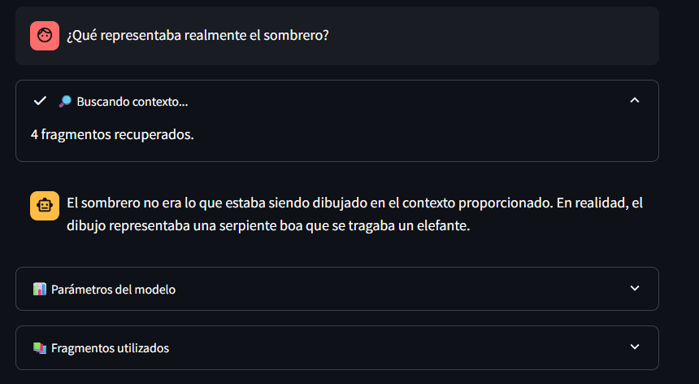
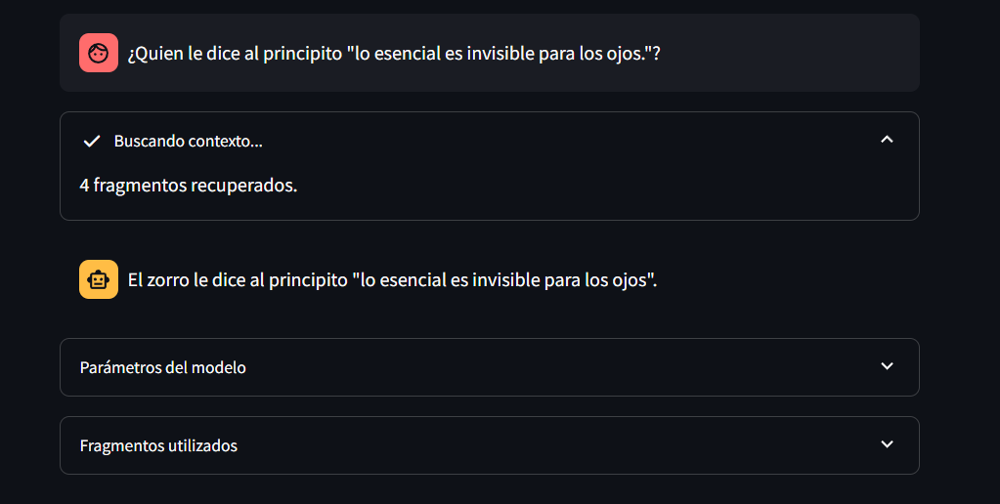

# Chatbot RAG with Langchain, Ollama, and Chroma

This project implements a Retrieval-Augmented Generation (RAG) chatbot that answers questions based on the content of a user-uploaded PDF. It uses Langchain for orchestration, Chroma for vector storage, and a local LLM served through Ollama. The system is designed to run locally and logs interactions using LangSmith.

---

## Why Mistral?

The `mistral` model was selected for its balance between performance and responsiveness. The project initially used `llama3`, but it resulted in significantly slower responses, which affected the user experience.

---

## Step-by-step: How to clone and run the project

### 1. Clone the repository

```bash
git clone https://github.com/xilenAtenea/chatbot-rag
cd chatbot-rag
````

---

### 2. Install and start Ollama

If you haven't installed [Ollama](https://ollama.com) yet, do it first.

Then start the Ollama server (only needs to run in the background):

```bash
ollama serve
```

---

### 3. Pull required models

Run the following commands to download the models locally:

```bash
ollama pull mistral
ollama pull nomic-embed-text
```

> `mistral` is used for answering questions.
> `nomic-embed-text` is used to convert text chunks into vector embeddings.

---

### 4. Install dependencies (using uv)

> This project uses `uv` to manage dependencies. If you don't have `uv`, install it with:

```bash
pip install uv
```

Then install the required packages:

```bash
uv pip install -r pyproject.toml
```

---

### 5. Set up environment variables

Create a `.env` file in the root directory with the following content:

```
LANGSMITH_API_KEY=your_langsmith_api_key
LANGSMITH_TRACING=true
USER_AGENT=chatbot-rag
```

> You can get a free API key at [https://smith.langchain.com](https://smith.langchain.com)

---

### 6. Run the chatbot

Start the Streamlit app:

```bash
uv run streamlit run src/app.py
```

Once running, you'll be able to:

* Upload a PDF file
* Adjust LLM parameters (`temperature`, `top_p`, `top_k`)
* Ask questions about its content
* See which chunks were used to generate the answer
* View response metadata and trace it on LangSmith

---

### 7. Example questions

You can try questions like (taking into account the example pdf, where the book "el principito" in Spanish was used):

* ¿Qué representaba realmente el sombrero?


* ¿Quien le dice al principito "lo esencial es invisible para los ojos."?


---

## Project structure

```
chatbot-rag/
├── src/
│   ├── app.py           # Streamlit UI
│   └── rag_logic.py           # PDF processing, RAG logic
├── data/                # Sample PDF
├── imgs/
├── .env                 # your own API keys and settings
├── .gitignore
├── pyproject.toml
└── README.md
```
